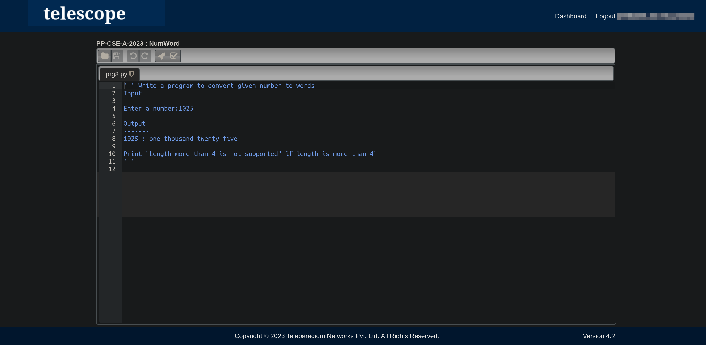
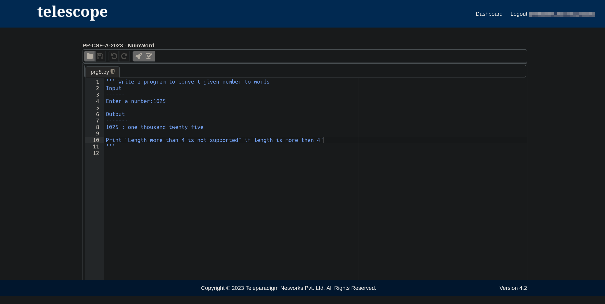

# Tesselator-BetterDarkModeBetter Dark Mode UserCSS for Tesselator and Telescope for use with [dark reader](https://darkreader.org/) extension.
Makes the UI look better by making it look flat by removing (or hiding) gradients and image backgrounds.

## Note: 
 - Makes only the editor page and the header look better for Tesselator/Telescope and doesn't touch any other websites.

## Installation 
 - Install [Dark Reader](https://darkreader.org) and [Stylus](https://add0n.com/stylus.html).  
 - GoTo https://userstyles.world/style/10425/tesselatortelescope-better-dark-mode and click install, again click install.  
 - Tesselator-BetterDarkMode is successfully installed!! Try logging in to Tesselator/Telescope and attempt any program to enjoy the better experience.

# Preview  
Before|After
-|-
|
